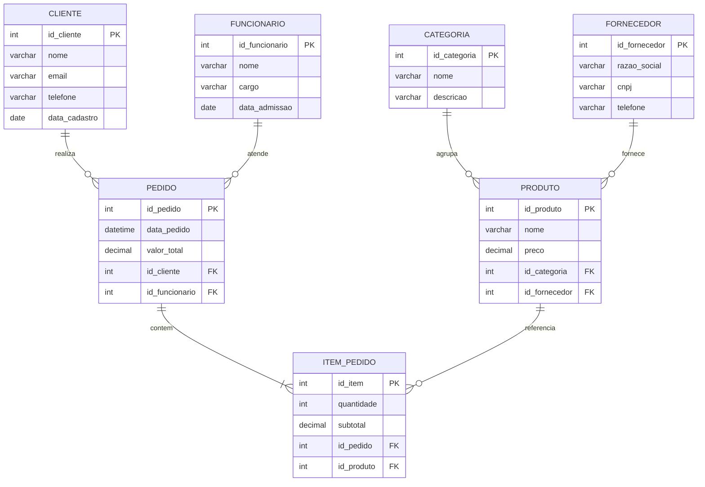

# Atividade de Desenvolvimento: CREATE TABLE e INSERT INTO

**Disciplina:** Banco de Dados  
**Professor:** Iuri — SENAC São Leopoldo  
**Base:** Mapeamento SQL (MER → Banco de Dados)  
**Formato de entrega:** 1 arquivo `.sql` por dupla

---

## Objetivo

Revisar e aplicar os comandos `CREATE TABLE` e `INSERT INTO`, transformando um Modelo Entidade-Relacionamento (MER) em um banco de dados funcional com dados de teste válidos.

Ao final, o script deve:

- criar o banco de dados;
- criar as tabelas com relacionamentos corretos;
- inserir dados de teste que respeitem tipos e chaves estrangeiras.

---

## Cenário para desenvolvimento

Considere o seguinte MER simplificado de um sistema de **pedidos de restaurante**:



> **Observação:** o MER acima possui **7 tabelas**. A atividade original exige no mínimo **6 tabelas** — use este cenário ou adapte o MER da sua dupla no Miro.

---

## Parte 1 — Revisão teórica (responda antes de codificar)

1. Qual a diferença entre `INT`, `VARCHAR(n)`, `DECIMAL(p,s)`, `DATE` e `DATETIME`? Dê um exemplo de uso para cada um neste cenário.
2. O que é uma **chave primária (PK)**? Quando faz sentido usar `AUTO_INCREMENT`?
3. O que é uma **chave estrangeira (FK)**? Como ela garante integridade referencial?
4. Por que a ordem dos comandos `CREATE TABLE` e `INSERT INTO` importa?
5. O que acontece se você tentar inserir um `id_cliente = 99` em `PEDIDO`, mas esse cliente não existir na tabela `CLIENTE`?

---

## Parte 2 — CREATE TABLE (desenvolvimento)

Implemente o script SQL seguindo os requisitos abaixo.

### 2.1 Criação do banco

```sql
CREATE DATABASE nome_do_banco;
USE nome_do_banco;
```

Substitua `nome_do_banco` por um nome coerente com o projeto da dupla (ex.: `restaurante_db`).

### 2.2 Ordem obrigatória de criação das tabelas

Siga esta sequência para evitar erros de FK:

| Etapa | Tabelas (sem dependência de FK) |
|-------|----------------------------------|
| 1ª    | `CLIENTE`, `CATEGORIA`, `FORNECEDOR`, `FUNCIONARIO` |
| 2ª    | `PRODUTO` (depende de `CATEGORIA` e `FORNECEDOR`) |
| 3ª    | `PEDIDO` (depende de `CLIENTE` e `FUNCIONARIO`) |
| 4ª    | `ITEM_PEDIDO` (depende de `PEDIDO` e `PRODUTO`) |

### 2.3 Requisitos de cada CREATE TABLE

Cada tabela deve ter:

| Requisito | Descrição |
|-----------|-----------|
| Nome coerente | Nomes em português ou inglês, padronizados (snake_case recomendado) |
| Colunas definidas | Todos os atributos do MER representados |
| Tipagem correta | `INT`, `VARCHAR(n)`, `DECIMAL(p,s)`, `DATE`, `DATETIME` conforme o atributo |
| PK definida | Toda tabela com chave primária; use `AUTO_INCREMENT` quando fizer sentido |
| FK declarada | Relacionamentos do MER implementados com `FOREIGN KEY` |

### 2.4 Exemplo de referência (não copie sem adaptar)

```sql
CREATE TABLE cliente (
    id_cliente INT AUTO_INCREMENT PRIMARY KEY,
    nome VARCHAR(100) NOT NULL,
    email VARCHAR(150) NOT NULL,
    telefone VARCHAR(20),
    data_cadastro DATE NOT NULL
);
```

```sql
CREATE TABLE produto (
    id_produto INT AUTO_INCREMENT PRIMARY KEY,
    nome VARCHAR(100) NOT NULL,
    preco DECIMAL(10, 2) NOT NULL,
    id_categoria INT NOT NULL,
    id_fornecedor INT NOT NULL,
    CONSTRAINT fk_produto_categoria
        FOREIGN KEY (id_categoria) REFERENCES categoria(id_categoria),
    CONSTRAINT fk_produto_fornecedor
        FOREIGN KEY (id_fornecedor) REFERENCES fornecedor(id_fornecedor)
);
```

### 2.5 Checklist CREATE TABLE

Marque cada item ao concluir:

- [ ] Banco criado com `CREATE DATABASE` e `USE`
- [ ] Mínimo de 6 tabelas criadas
- [ ] Tabelas independentes criadas antes das dependentes
- [ ] Todas as PKs definidas
- [ ] Todas as FKs apontando para as PKs corretas
- [ ] Tipos de dados adequados em todas as colunas
- [ ] Script executa sem erro de sintaxe

---

## Parte 3 — INSERT INTO (desenvolvimento)

### 3.1 Regra de ordem dos INSERTs

```text
1. Insira primeiro nas tabelas de origem (PK) — sem FK ou só como referenciadas
2. Depois insira nas tabelas que possuem FK
```

**Ordem sugerida para este cenário:**

1. `CLIENTE`, `CATEGORIA`, `FORNECEDOR`, `FUNCIONARIO`
2. `PRODUTO`
3. `PEDIDO`
4. `ITEM_PEDIDO`

> **Regra prática:** se uma tabela referencia `id_x`, então esse `id_x` já precisa existir na tabela de origem.

### 3.2 Requisitos dos INSERTs

- Inserir **no mínimo 3 registros por tabela**
- Valores devem respeitar **tipos de dados** (número, texto, data, decimal)
- Valores de FK devem referenciar **IDs que já existem**
- Datas e decimais em formato válido

### 3.3 Exemplo de referência

```sql
INSERT INTO cliente (nome, email, telefone, data_cadastro) VALUES
('Ana Silva', 'ana.silva@email.com', '(51) 99999-1111', '2024-01-15'),
('Bruno Costa', 'bruno.costa@email.com', '(51) 99999-2222', '2024-02-20'),
('Carla Mendes', 'carla.mendes@email.com', '(51) 99999-3333', '2024-03-10');
```

```sql
INSERT INTO pedido (data_pedido, valor_total, id_cliente, id_funcionario) VALUES
('2025-06-01 12:30:00', 45.90, 1, 1),
('2025-06-01 13:15:00', 32.50, 2, 2),
('2025-06-02 19:00:00', 78.00, 3, 1);
```

### 3.4 Desafio de consistência

Os dados inseridos devem fazer sentido no contexto do negócio. Por exemplo:

- O `valor_total` de um pedido deve ser coerente com a soma dos `subtotal` dos itens (quando aplicável)
- Um produto deve pertencer a uma categoria e fornecedor existentes
- Não repita e-mails de clientes se houver restrição de unicidade (opcional, mas recomendado)

### 3.5 Checklist INSERT INTO

- [ ] Mínimo de 3 registros em cada tabela
- [ ] INSERTs nas tabelas pai antes das tabelas filhas
- [ ] Nenhum valor de FK aponta para ID inexistente
- [ ] Datas no formato `YYYY-MM-DD` ou `YYYY-MM-DD HH:MM:SS`
- [ ] Decimais com ponto (ex.: `19.90`, não `19,90`)
- [ ] Script executa sem erro de integridade referencial

---

## Parte 4 — Validação final

Execute o script completo em um servidor MySQL/MariaDB e confirme:

```sql
-- Verificar quantidade de registros por tabela
SELECT 'cliente' AS tabela, COUNT(*) AS total FROM cliente
UNION ALL SELECT 'categoria', COUNT(*) FROM categoria
UNION ALL SELECT 'fornecedor', COUNT(*) FROM fornecedor
UNION ALL SELECT 'funcionario', COUNT(*) FROM funcionario
UNION ALL SELECT 'produto', COUNT(*) FROM produto
UNION ALL SELECT 'pedido', COUNT(*) FROM pedido
UNION ALL SELECT 'item_pedido', COUNT(*) FROM item_pedido;
```

Responda:

1. Quantas tabelas foram criadas?
2. Algum `INSERT` falhou? Por quê?
3. Os relacionamentos do MER estão refletidos corretamente nas FKs?

---

## Critérios de avaliação

| Critério | Peso |
|----------|------|
| CREATE DATABASE e USE corretos | 10% |
| CREATE TABLE com tipagem e PKs | 30% |
| FOREIGN KEY conforme o MER | 25% |
| INSERT INTO (mín. 3 por tabela, ordem correta) | 25% |
| Script executa sem erros | 10% |

---

## Estrutura esperada do arquivo `.sql`

```sql
-- =============================================
-- Atividade: Mapeamento SQL
-- Dupla: Nome 1 / Nome 2
-- Banco: nome_do_banco
-- =============================================

CREATE DATABASE ...;
USE ...;

-- ETAPA 1: Tabelas independentes
CREATE TABLE ...;
CREATE TABLE ...;

-- ETAPA 2: Tabelas dependentes
CREATE TABLE ...;
CREATE TABLE ...;

-- ETAPA 3: Dados nas tabelas de origem
INSERT INTO ...;
INSERT INTO ...;

-- ETAPA 4: Dados nas tabelas com FK
INSERT INTO ...;
INSERT INTO ...;
```

---

## Entrega

- **Arquivo:** `mapeamento_sql_dupla.sql`
- **Conteúdo:** script completo com `CREATE DATABASE`, `CREATE TABLE` e `INSERT INTO`
- **Teste:** executar o script do início ao fim antes de enviar
